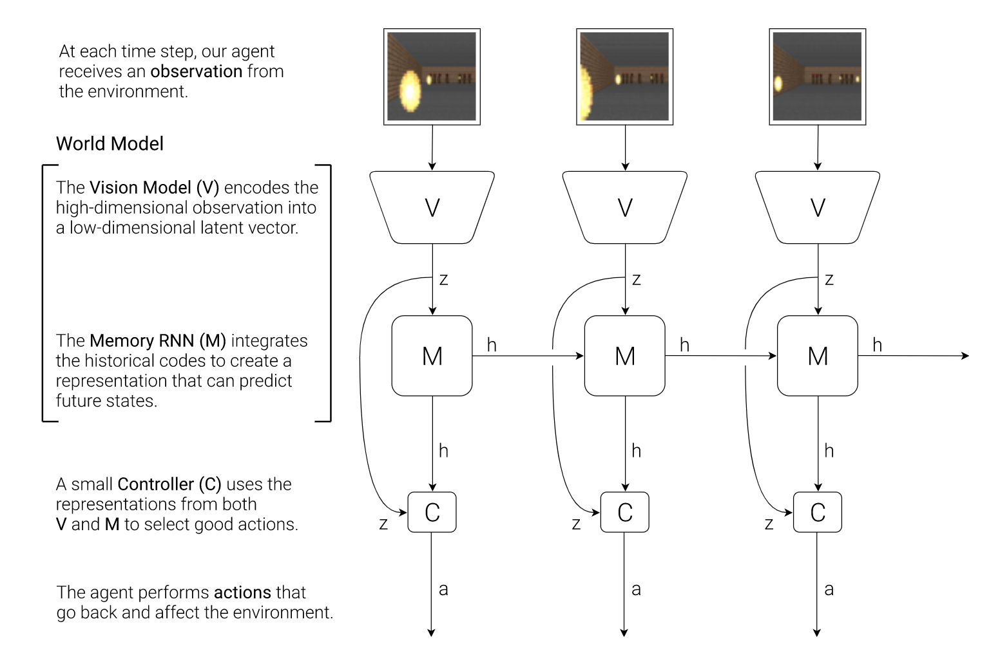
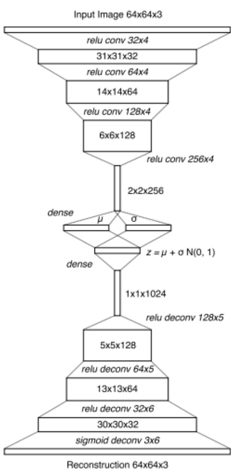
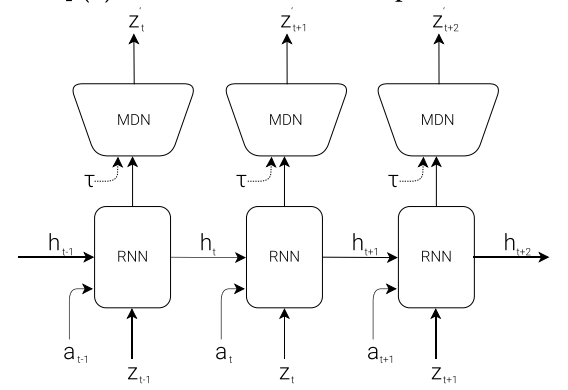
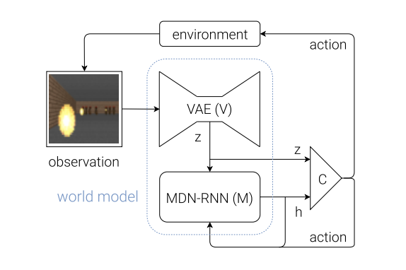
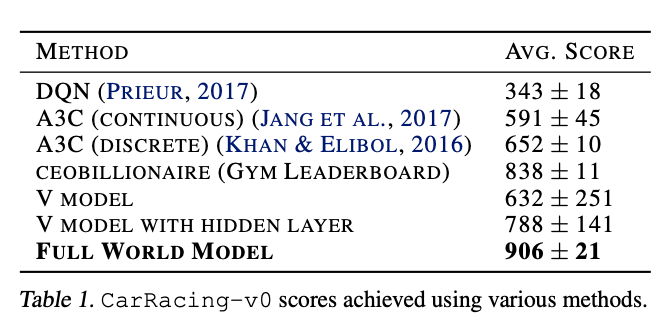

# World Model
## Motivation

There are two major schools of reinforcement learning -- model-based and model-free. The difference lies in whether the agent models the environment. In the model-based approach, model substitution faces a contradiction: 

* In order to learn the environment more effectively, it requires a more powerful and expressive model. 
* Reinforcement learning is difficult to learn millions of weights for large models (the search space for reward distribution is too large). 

Since the scale of the model is mainly limited by the search space for reward distribution, and the main advantage of a larger and more complex model lies in the learning environment, can the model be taken apart? Let a larger complex model be dedicated to the learning environment without involving the issue of reward distribution, while letting a smaller model perform the task, so that the larger complex model will not affect the search space of reward distribution, and the smaller model can "Ask" a larger model to gain an understanding of the environment and learn better.

## Architecture

Based on the above ideas, World Models uses a combination of two models to bypass the contradiction mentioned at the beginning: a large world model, a small controller model in the modeling environment, learning to perform tasks.

From the above architecture diagram, we can see that the world model actually includes two parts, a visual component for encoding visual information, and a memory component for predicting future encoding based on historical information. 

Specifically, the vision component is implemented based on VAE (Auto Encoder), which encodes video frames into low-dimensional latent vectors. 

The memory component is implemented based on the recurrent neural network (LSTM) to predict the latent vector generated by the visual component in the future.

The choice of visual components and memory components is very natural. However, as can be seen from the above figure, the output layer of the memory component uses MDN (Mixed Density Network), so that the probability distribution of the latent vector-the mixed Gaussian distribution can be output. 

The controller model is very simple, it is a linear model. The following figure shows the interaction between the three components:

Both the visual component and the memory component use standard models (VAE, LSTM, MDN), which can be trained on the GPU. 

Since the controller model is a very simple linear model, various training strategies can be used as much as possible, including evolutionary algorithms. Specifically, CMA-ES (Covariance Matrix Adaptive Evolution Strategy) is used. CMA-ES performed better on a linear model of this scale.

On CarRacing-v0, the world model achieved an average score of 906 ± 21 in 100 tests, which solved this problem (reaching more than 900 points) and achieved a new state-of-the-art performance. (The average score of the traditional deep RL method is between 591 and 652. The highest score reported on the previous rankings is 838 ± 11 (ceobillionaire algorithm, unpublished).) This verifies the validity of the world model.

## Dream

From the previous component interaction diagram, we can see that the controller model (C) does not directly touch the environment (observation), and its perception of the environment is completely dependent on the world model. So, what if the world model provided to the controller is not based on observations of the real environment, but an illusion fabricated by itself?

In fact, since the controller model's perception of the environment completely relies on the world model, it cannot distinguish between reality and illusion. Therefore, it can learn from the "dream" made up for it by the world model. If the fictional "dream" of the world model is good enough, then what the controller model learns in the dream can be transferred to the real scene in the future. 

The author of the thesis trained the world model to simulate the VizDoom environment, allowing the controller model to learn to move in dreams and avoid fireballs fired by monsters generated by the memory model. After migrating to the actual environment, the score of 100 consecutive random tests is about 1100 frames, which far exceeds the required 750 frames (the standard for problem solving).

But there was a problem in training, just like when people dream that they sometimes dream of having superpowers. The controller model in the dream structure of the memory component can access all the hidden states of the memory component-including the internal state and the memory of the game engine. Therefore, the controller model is easier to find the loopholes in the world model, and use them, for example, by moving in a specific way, silent monsters in the dream, so that they do not launch fireballs, or even magically extinguish the fireballs about to be launched. 

Fortunately, the output layer of the memory model is MDN, in other words, the output is a mixture of Gaussian distribution, which allows us to increase the randomness by adjusting the temperature parameters. On the one hand, it increases the difficulty for the controller to crack the "cheating". On the other hand, appropriately increasing the temperature parameter can increase the challenge. Agents trained in dreams of high temperature (high difficulty) usually perform better when they migrate to the real environment. This is in fact the same reason that the difficulty of the general mock exam is higher than that of the formal exam. Of course, the temperature parameter is too high, the randomness is too high, and the difficulty is too great, and the agent cannot successfully learn. 

In addition to making it easier to increase the difficulty in the dream and better train the agent, learning in the dream also saves resources (the game engine needs to use a lot of computing resources to render images and perform some physical calculations that are not directly related to the game).

## Conclusion

In sum, the advantage of the model:

* The models are spliced ​​cleverly enough, as the architecture section has shown.
* The "pain points" of some "strong vision" games are captured. The RNN in the memory component M mentioned just now is an expert at generating sequences, so it should not be a problem to "imagine" some image frames based on the previous game images (RNN generates some hidden variables z, and then according to the hidden variables z, the visual component The image frame generated by VAE's decode can be used). So for "strong vision" games, it seems a good idea to use RNN's memory capabilities for visual prediction.

