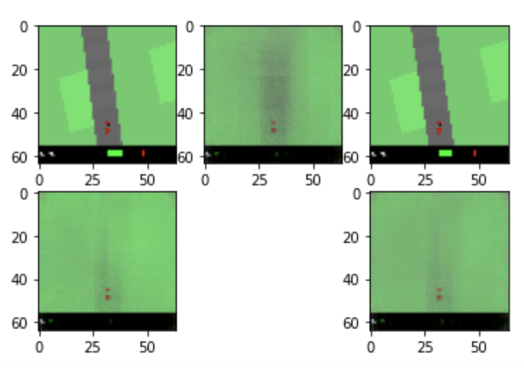

# Experiment

The code of experiment mainly adopt from [this repo](https://github.com/pantelis-classes/world-models-latest).

My code is [here](../code)

## Generate data

Samples from the generated data:

## VAE training

* The original and z decoded:

* The original and reconstructed

* Samples from reconstructed

## Driving in the true environment

Observation:

Reconstructed:

Driving(Ground Truth):

## In the dream

sample of current real image(fig1) , predicted next image(fig2)  (decoded from RNN), read next image(fig3),   current dream image(fig4) and decoded next image(fig5)

Figure of action_direction, action_accel, action_brake, rewards, pred_rewards.

## Result Analysis

* At the step of generating data, at the first trial, I generate 200 episides with 300 time steps each.

* However,when I go to the second step : VAE training , I found that due to the limitation of system memory,  the training can only handle 100 episodes with 300 time steps each. So "100 episodes with 300 time steps" was the data I used for the whole training.

* The training for VAE varies for differrent loss, KL loss converge very quickly at approximately 9.5, general loss and reconstruction loss decrease slowly and the training process always get killed due to limitation of system memory. Normally, general loss reaches approximately 60 and reconstruction loss reaches 50. From the trend, we can assume that they are close to convergence but due to the limitation, we have no statistical evidence.

* The training for RNN is time-consuming(4000 steps), the general loss decrease very slowly, which finally reach approximately 1.2, and rnn reward loss decreae relative fast and finally converge to $ \leq $ 0.01. 

* The training for controller is a little bit fast, the controller achieve the best at the very first stage and more training did not get better result.
*  The result looks good from the simulated driving situation, the car could identify the grid and choose the right time to change direction.

