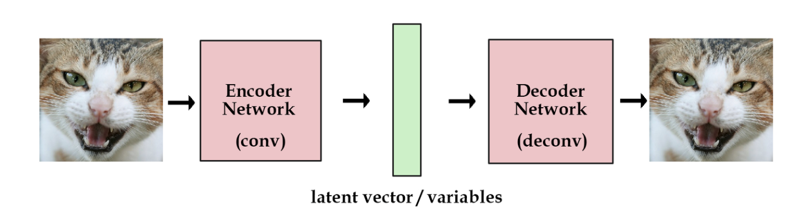
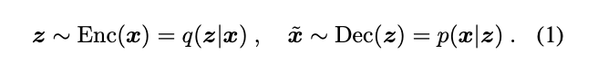
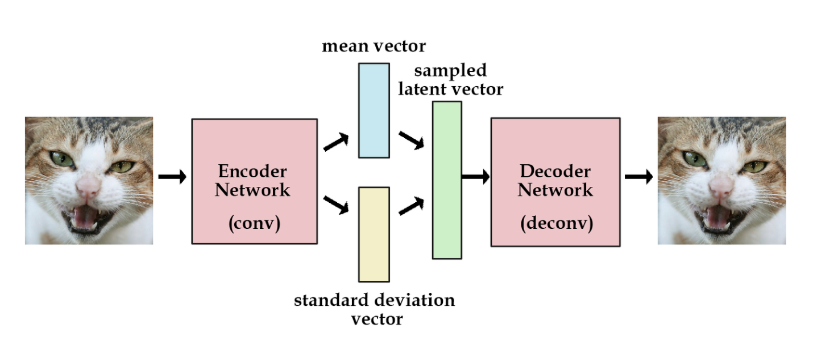
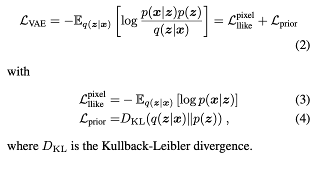
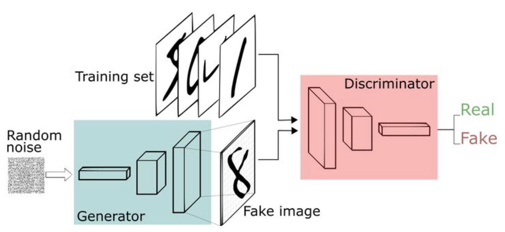
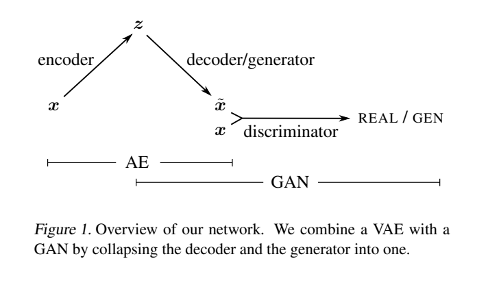
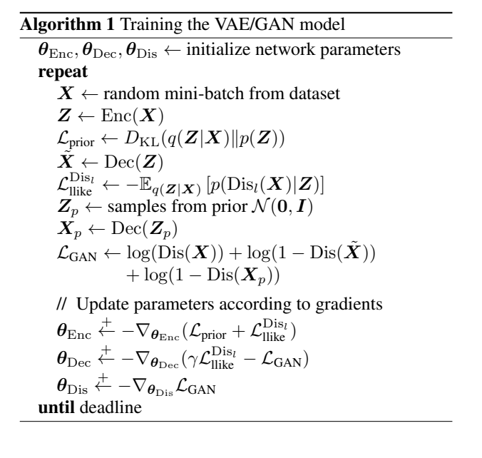
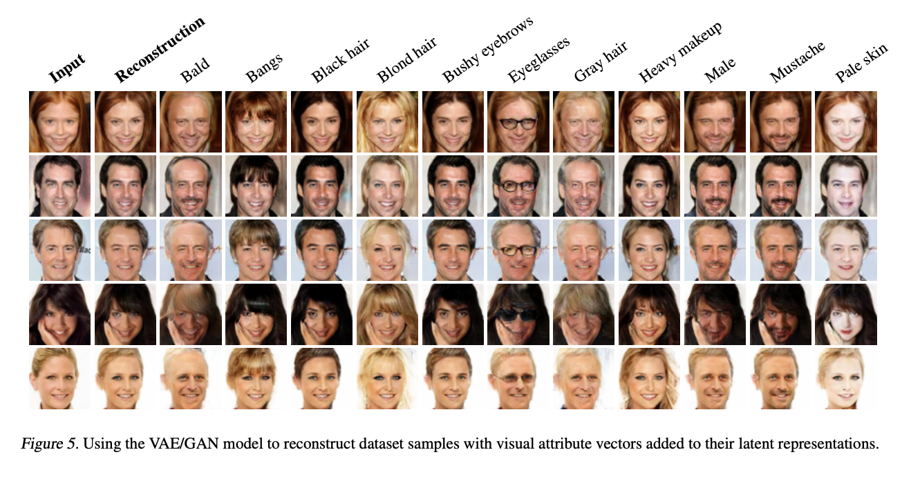

# VAE-GAN

Experiment Report is [here](task3_2.md)

## Motivation

If you use an autoencoder for generation tasks, the common problem is that you will get very fuzzy results; if you use the original GAN, the training will be unstable. Produce clear results, but also produce different output.

## AutoEncoder

The structure of the autoencoder is as follows: It consists of an Encoder and a Decoder. The Encoder encodes the image into a hidden vector, and the Decoder decodes the image. Through training, the model can generate the same type of image as the training image

## VAE

One disadvantage of the autoencoder is that we don't know the distribution form of the hidden vector and cannot generate arbitrary pictures.

The Variational Autoencoder (VAE) solves this problem very well. It reparametrize the hidden vector to make it obey a Gaussian distribution, so that we only need to give a hidden vector that obeys the Gaussian distribution and we can generate the desired Pictured.

The loss of VAE consists of two parts: the first is to ensure that the generated picture has a certain similarity with the original picture (mean square loss function), and the second is to ensure that the hidden vector obeys the Gaussian distribution (KL divergence).

## GAN

The full name of GAN is a generative confrontation network. This network is composed of two parts: a generation network and a confrontation network. The generation network generates fake pictures. When judging the network, the real picture is judged as true, and the fake picture is judged as false. Finally, I hope that the pictures generated by the generator can be To deceive and discriminate the network with fake and real.

The network structure of GAN is as follows:

## VAE-GAN

It uses GAN to strengthen VAE. The hidden vector of VAE obeys Gaussian distribution, and the input of GAN is a D-dimensional noise vector.

GAN's loss is also composed of two parts: for the generation network, it needs to make the fake pictures it generates can fool the discriminator with fake pictures, and for the discriminating network, it needs to judge real pictures and fake pictures. false.

It is natural to think of whether VAE can be used as a GAN generator. Such a network not only has the characteristics of VAE's controllable picture generation, but also has the excellent performance of GAN to generate pictures.

An appealing property of GAN is that its discriminator network implicitly has to learn a rich similarity metric for images, so as to discriminate them from “non-images”. We thus propose to exploit this observation so as to transfer the properties of images learned by the discriminator into a more abstract reconstruction error for the VAE. The end result will be a method that combines the advantage of GAN as a high quality generative model and VAE as a method that produces an encoder of data into the latent space z

It can be seen from the structure diagram that the first half of this network is a complete VAE, followed by a GAN, where VAE and GAN share a decoder.

For the VAE-GAN network, It combines the advantages of VAE and GAN in generation, and can realize the generation of controllable pictures. This is also the biggest feature of this network.

Add a discriminator to the original VAE, and see the more real the output image, the better. If you just do VAE, the picture will be blurry. After adding the discriminator, the output is forced to be as real as possible. From the perspective of GAN, when training GAN, the generator has never seen what the real image looks like. If through the auto-encoder architecture, the generator will not only fool the discriminator, it has seen what the real image looks like. So VAE GAN will be more stable to learn.

In VAE-GAN, the optimization goals of each component are as follows: encoder: minimize reconstruction error, and it is hoped that the encoded vector z is as close to the real as possible. Generator (also decoder): Minimize reconstruction error, and cheat discriminator Discriminator: Distinguish between real pictures and pictures generated by generator.

* Sample out M samples from the data set  $ x^{1} $, $ x^{2} $ , $ x^{M} $ 
* Generate M vectors from the encoder $ \tilde{z}^{1} $, $ \tilde{z}^{2} $,$ \tilde{z}^{M} $ ,$ \tilde{z}^{i} = En(x^{i})$
* Generate M outputs from Generator  $ \tilde{x}^{1} $, $ \tilde{x}^{2} $,$ \tilde{z}^{M} $ ,$ \tilde{x}^{i} = Generator(\tilde{z}^{i})$
* Sample M vectors from a distribution $P(z)$ , $ \=hat{z}^{1}$, $ \hat{z}^{2}$, $ \hat{z}^{M}$
* Generate M outputs from Generator $ \hat{x}^{1}$, $ \hat{x}^{2}$, $ \hat{x}^{M}$ ,$ \hat{x}^{i} = Generator(\hat{z}^{i})$
* Optimize Encoder: update parameters to reduce $ ||  \tilde{x}^{i} - x^{i}|| $ and $ KL(P(\tilde{z}^{i}| x^{i}) || P(z))$ In other words, it is hoped that the output generated by the decoder (that is, the generator) can be as close to the original input as possible, and it is also hoped that the $z$ in the middle is as close to the normal distribution as possible.
* Optimize Generator: update parameters to reduce  $ ||  \tilde{x}^{i} - x^{i}|| $ , at the same time, make  $Discriminator( \tilde{x}^{i} )$ larger. That is to fool the discriminator.
* Optimize Discriminator: update parameters to increase  $Discriminator( x^{i} )$ , decrease $Discriminator( \tilde{x}^{i} )$, $Discriminator( \hat{x}^{i} )$ 

In the code of VAE-GAN, the discriminator returns two values, one value represents the true and false value of the picture, and the other value represents the characteristic value of the picture. When calculating the network loss, in addition to the general VAE loss and In addition to the GAN loss, the network also adds a feature loss, that is, the feature loss between the generated picture and the original picture. The loss is designed to allow the network to generate a picture with the same characteristics as the original picture. That is, in the experiment, you can control the characteristics of the network generated pictures.

The following is the performance provided by author:

It can be seen from the figure that the generated pictures have certain characteristics.
There is a question here, how do we let the network know what kind of image you want to generate?

If we want to generate a picture with a certain feature, we must first extract the feature vector of the feature, and then add the feature vector to the hidden vector of the network, so that the generated pictures have the feature.

Picture feature vector extraction process: The average difference vector of a series of hidden vectors of pictures with this characteristic and the hidden vectors of pictures without this characteristic is taken as the vector of this characteristic.

## Conclusion 

In summary, the VAE-GAN is to connect the VAE decoder as the geneator of GAN to GAN, which is actually equivalent to combining the loss of VAE and the loss of GAN.

