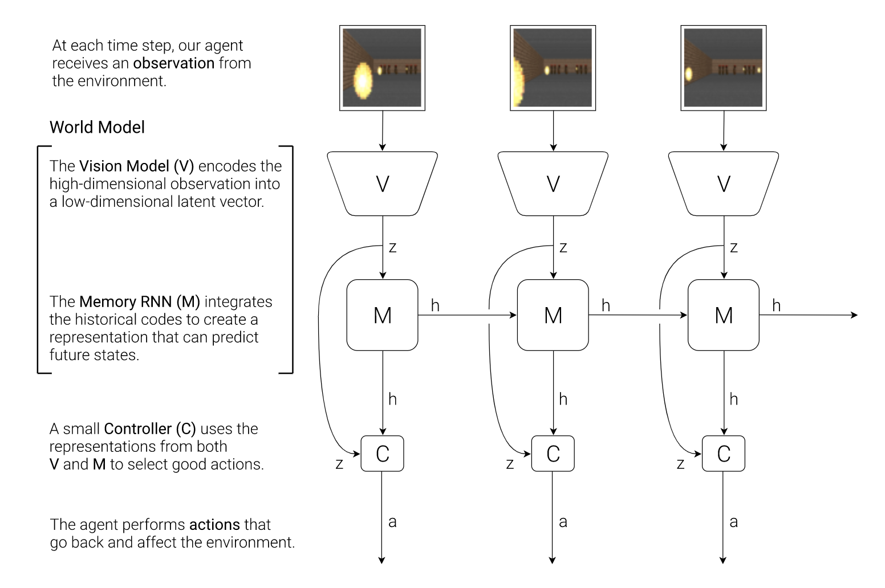

## VAE-GAN experiment

The code is adopted from [here](https://github.com/leoHeidel/vae-gan-tf2) which is an implementation of VAE-GAN

To repeat the experiment of carcacing, we put part of this code into our [origin code](https://github.com/pantelis-classes/world-models-latest) 

As the report for [VAE-GAN](task3_2.md), we know that it has the following structure:


So we mianly use the definition of structure of AVE-GAN in keras from code [here](https://github.com/leoHeidel/vae-gan-tf2/blob/master/vae-gan.ipynb), we name is as [arch_vaegan.py](../code/vae/arch_vaegann.py) to have a redefinition of out original VAE structure.

In detail, for the three part of VAE-GAN, we have:

* Encoder

```
def encoder(self):
        input_E = keras.layers.Input(shape=(IM_DIM, IM_DIM, 3))
    
        X = keras.layers.Conv2D(filters=DEPTH*2, kernel_size=K_SIZE, strides=2, padding='same')(input_E)
        X = keras.layers.BatchNormalization()(X)
        X = keras.layers.LeakyReLU(alpha=0.2)(X)

        X = keras.layers.Conv2D(filters=DEPTH*4, kernel_size=K_SIZE, strides=2, padding='same')(X)
        X = keras.layers.BatchNormalization()(X)
        X = keras.layers.LeakyReLU(alpha=0.2)(X)

        X = keras.layers.Conv2D(filters=DEPTH*8, kernel_size=K_SIZE, strides=2, padding='same')(X)
        X = keras.layers.BatchNormalization()(X)
        X = keras.layers.LeakyReLU(alpha=0.2)(X)
    
        X = keras.layers.Flatten()(X)
        X = keras.layers.Dense(LATENT_DEPTH)(X)    
        X = keras.layers.BatchNormalization()(X)
        X = keras.layers.LeakyReLU(alpha=0.2)(X)
    
        mean = keras.layers.Dense(LATENT_DEPTH,activation="tanh")(X)
        logsigma = keras.layers.Dense(LATENT_DEPTH,activation="tanh")(X)
        latent = keras.layers.Lambda(self.sampling, output_shape=(LATENT_DEPTH,))([mean, logsigma])
    
        kl_loss = 1 + logsigma - keras.backend.square(mean) - keras.backend.exp(logsigma)
        kl_loss = keras.backend.mean(kl_loss, axis=-1)
        kl_loss *= -0.5
    
        return keras.models.Model(input_E, [mean, logsigma, kl_loss, latent,])
```

* generator：

```
def generator(self):
        input_G = keras.layers.Input(shape=(LATENT_DEPTH,))

        X = keras.layers.Dense(8*8*DEPTH*8)(input_G)
        X = keras.layers.BatchNormalization()(X)
        X = keras.layers.LeakyReLU(alpha=0.2)(X)
        X = keras.layers.Reshape((8, 8, DEPTH * 8))(X)
    
        X = keras.layers.Conv2DTranspose(filters=DEPTH*8, kernel_size=K_SIZE, strides=2, padding='same')(X)
        X = keras.layers.BatchNormalization()(X)
        X = keras.layers.LeakyReLU(alpha=0.2)(X)

        X = keras.layers.Conv2DTranspose(filters=DEPTH*4, kernel_size=K_SIZE, strides=2, padding='same')(X)
        X = keras.layers.BatchNormalization()(X)
        X = keras.layers.LeakyReLU(alpha=0.2)(X)
    
        X = keras.layers.Conv2DTranspose(filters=DEPTH, kernel_size=K_SIZE, strides=2, padding='same')(X)
        X = keras.layers.BatchNormalization()(X)
        X = keras.layers.LeakyReLU(alpha=0.2)(X)
    
        X = keras.layers.Conv2D(filters=3, kernel_size=K_SIZE, padding='same')(X)
        X = keras.layers.Activation('sigmoid')(X)

        return keras.models.Model(input_G, X)
```

* Discriminator
```

def discriminator(self):
        input_D = keras.layers.Input(shape=(IM_DIM, IM_DIM, 3))
    
        X = keras.layers.Conv2D(filters=DEPTH, kernel_size=K_SIZE, strides=2, padding='same')(input_D)
        X = keras.layers.LeakyReLU(alpha=0.2)(X)
    
        X = keras.layers.Conv2D(filters=DEPTH*4, kernel_size=K_SIZE, strides=2, padding='same')(input_D)
        X = keras.layers.LeakyReLU(alpha=0.2)(X)
        X = keras.layers.BatchNormalization()(X)

        X = keras.layers.Conv2D(filters=DEPTH*8, kernel_size=K_SIZE, strides=2, padding='same')(X)
        X = keras.layers.BatchNormalization()(X)
        X = keras.layers.LeakyReLU(alpha=0.2)(X)

        X = keras.layers.Conv2D(filters=DEPTH*8, kernel_size=K_SIZE, padding='same')(X)
        inner_output = keras.layers.Flatten()(X)
        X = keras.layers.BatchNormalization()(X)
        X = keras.layers.LeakyReLU(alpha=0.2)(X)
    
        X = keras.layers.Flatten()(X)
        X = keras.layers.Dense(DEPTH*8)(X)
        X = keras.layers.BatchNormalization()(X)
        X = keras.layers.LeakyReLU(alpha=0.2)(X)
    
        output = keras.layers.Dense(1)(X)    
    
        return keras.models.Model(input_D, [output, inner_output])
```

The we link the three component together and modifies other things like weight saving and loading, and part of the training code to make the traning could run.

To distinguish the training process from original training of VAE, we have another training component [02_train_vae_gan.py](../code/02_train_vae_gan.py)

It is expected that VAE-GAN has more power over VAE on the ability of reconstructing images(more accurate and more features captured).



By investaging into the architecture of world models, we find that a more powerful VAE-GAN component not only increase the ability of reconstructing images, but also give a better input for RNN component and controller agent component.

So the difference from original VAE via experiment:

* better reconstruction ability for V component. but more time consuming on VAE-GAN training.
* almost same efficient on RNN training, better result on loss.
* almost same efficient on controller training with better reward.

Due to the limitation of system memory, the vae-gan training seems use more resources than VAE, then we reduce the episodes we use for training. the difference on the true driving is hard to distinguish via eyes but can be reflected by the statistic result. 
